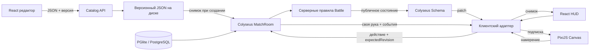

# Картишки

Рабочий первый срез CCG: отдельный редактор карт и бой двух игроков.
TypeScript / React / PixiJS 8 / Colyseus 0.18, npm workspaces, русский язык
по умолчанию и английский перевод через i18next. Node >=22.12, npm >=10.

## Запуск

```powershell
Set-Location D:\KARTISHKI
npm ci
npm run dev
```

- Игра: http://127.0.0.1:5173 — гости: две вкладки и «Найти соперника». Аккаунт сохраняет колоду, рейтинг и добычу.
- Редактор: http://127.0.0.1:5174.
- Colyseus и API: http://127.0.0.1:2567.

`.env.example` показывает переменные; сервер не
подключает dotenv — переменные сервера задаются в оболочке. Vite читает
`apps/client/.env.local` и `apps/editor/.env.local` для VITE_SERVER_URL.
PORT меняет порт сервера. Все dev-сервисы слушают loopback.
Профили по умолчанию в встроенном PGlite (`data/players`). DATABASE_URL
переключает на PostgreSQL; PLAYER_DATA_DIR меняет каталог PGlite.

## Как играть

1. Гость играет серверной колодой. Аккаунт: регистрация, ежедневные 100 ✦,
   сохранение колоды из 30 карт коллекции, затем «Найти соперника».
2. На своём ходу нажмите карту в руке: сервер проверит ману и место на столе.
3. Существо бьёт только со следующего своего хода: потяните его на цель — карта останется на месте, появится стрелка.
4. Кнопка «Конец хода» справа отдаёт ход сопернику. После матча выйдите и найдите новую игру.

30 здоровья героя, 30 карт в колоде, до 10 карт в руке и 7 существ на столе.
Сервер перемешивает колоду; стартовая рука — 3 карты, активный игрок берёт ещё
одну. На каждом новом ходе пополняется мана (до 10), берётся карта и обновляется
готовность своих существ. Существо не атакует в ход призыва, атакует один раз
за свой ход; бой существ наносит взаимный урон одновременно. Герой не отвечает.
Карты сверх лимита руки сгорают. Пустая колода наносит растущий урон усталости.
Одновременная гибель героев — ничья, выход из активного матча — поражение.

Гостевой матч по-прежнему собирает колоду из последних 30 определений каталога
с повторами. Аккаунт приносит стартовую колоду и коллекцию (по 10 копий
стартовых карт). После победы двух аккаунтов сервер пишет ELO (K=32) и 50 ✦
победителю. Пачка — 5 карт за 100 ✦, в пачке гарантируется редкая или выше,
если такие есть в каталоге. Кейс — 1 карта за 200 ✦, приз считает сервер,
клиент крутит рулетку к уже известному индексу. Лестница: топ-10 по ELO.

## Свойства и способности

| ID | Название | Реализованное правило |
|---|---|---|
| contraceptive | Контрацептив | Поглощает следующий положительный урон целиком и исчезает; нулевой урон не расходует щит |
| offense | Обида | Устанавливает текущее и максимальное здоровье существа в 1, минуя щит |
| humiliation | Унижение | Устанавливает текущую атаку в 1, минуя щит |
| battlecry | Приветствие | Эффекты при розыгрыше существа |
| deathrattle | Прощание | Эффекты после удаления погибших существ со стола |
| enrage | Рейдж | Настраиваемая прибавка к атаке, пока существо ранено; полное лечение снимает её |

Свойства в карточке применяются к самому существу при призыве. Те же статусы
можно назначить эффектами Приветствия/Прощания. Поддержаны урон, лечение, прибавка
атаки и три статуса; цели — само существо, все вражеские существа, вражеский герой
(для героя только урон/лечение). Рейдж пока поддерживает только атаку на себя.
Унижение — установка текущего значения, а не вечный запрет изменений: последующие
баффы/снятие Рейджа меняют атаку, минимальное значение — 0.

Каждая волна одновременно погибших существ удаляется до её Прощаний. Очередь
разрешается в порядке размещения существ. Эффектов воскрешения и призыва пока нет.
Типы существ — расширяемые строковые ID; специфических правил для типов ещё нет.

## Редактор и публикация

Редактор поддерживает название RU/EN, русское описание, характеристики, пять
редкостей, список типов через запятую, свойства, список способностей и звуки
призыва/атаки/гибели. JSON можно импортировать и экспортировать. Новые эффекты
добавляются в серверный реестр кода; загруженный JavaScript не исполняется.

Фотографии PNG/JPEG/WebP: до 8 МБ и 24 мегапикселей, нормализация до 1024px.
Кадрирование: положение X/Y и размер квадратного кадра. Общая функция
`packages/shared/src/photo.ts` оставляет фото цветным и гоняет его через один из
четырёх гротескных пресетов (CMYK-офсет, ночная вспышка, мульт-аппликация,
ретро-гифка 64 цвета) либо оставляет оригинал. Насыщенность, контраст и
интенсивность крутятся вживую: редактор и карта используют тот же `renderPhoto`.
Pixi берёт текстуру из того же алгоритма. Фото и звук пока встроены в JSON как data URL.

Звуки MP3/WAV/OGG/WebM до 1 МБ на событие, с прослушиванием в редакторе.
Клиент проигрывает их по подтверждённым сервером событиям; звук можно выключить.
Наведение, появление карт и короткая линия/тряска при атаке — начальные анимации,
а не финальная художественная полировка. Учитывается prefers-reduced-motion.

`PUT /api/catalog` принимает тело
`{ card, version }`. Сервер повторно проверяет JSON и сохраняет файл атомарной
заменой. Конфликт версии возвращает 409: обновите каталог и повторите публикацию.
Максимум 30 определений. По умолчанию файл — `apps/server/data/catalog.json`
при запуске через npm workspace. CATALOG_FILE задаёт другой путь.

Новый матч получает снимок каталога; редактирование не меняет уже начатый бой.
Игра загружает определения, фото и звук по сети без пересборки. Каталог карт —
локальный JSON. Профили, коллекции, колоды, ELO и валюта — PGlite или PostgreSQL.

## Архитектура



React читает стабильные снимки через useSyncExternalStore. Pixi владеет сценой
и ticker. Клиент не решает результаты: сервер проверяет фазу, игрока, ревизию,
ману, руку, вместимость стола, владельца, готовность и цель атаки. Повтор принятого
действия с той же ревизией отклоняется. Руки и порядок колод не входят в публичную
Schema. События взятия карт не раскрывают ID; рука отправляется только владельцу.

Основные файлы: `apps/server/src/Battle.ts`, `MatchRoom.ts`, `catalog.ts`,
`players.ts`, `database.ts`, `apps/client/src/session.ts`, `Account.tsx`,
`Board.tsx`, `apps/editor/src/main.tsx`, `packages/shared/src/index.ts`,
`cards.ts`, `photo.ts`, `packages/i18n/src/index.ts`.

Для desktop используются относительные пути сборки Vite; UI не импортирует Node
API. Tauri/Electron сможет упаковать клиент и настроить адрес удалённого сервера.
Сам desktop wrapper ещё не создан.

## Проверки

```powershell
npm run typecheck
npm test
npm run build
# Требуется установленный Google Chrome; порты 2567, 5173, 5174 должны быть свободны.
npm run test:browser
```

Серверные тесты проверяют правила боя, аккаунты, колоды, добычу, ELO,
приватность, синхронизацию двух клиентов, валидацию и сохранение каталога.
Playwright поднимает отдельное окружение с тестовым ключом, каталогом и
PGlite в `.cache`, проходит редактор → публикацию → бой кликами по Pixi,
регистрацию и пачку, и сохраняет `artifacts/editor.png`, `artifacts/battle.png`,
`artifacts/account.png`. Тестовый ключ не используется обычным запуском.

## Git

Репозиторий уже инициализирован. Для нового пустого каталога: `git init -b main`.
Корневой package.json объявляет `apps/*` и `packages/*` как npm workspaces;
`.gitignore`, `.gitattributes` и lockfile включены в исходники.

После проверки текущего первого рабочего среза:

```powershell
git add .gitattributes .gitignore package.json package-lock.json tsconfig.json playwright.config.ts apps packages tests README.md IMPLEMENTATION_STATUS.md
git commit -m "feat: add card editor, battles and player metagame"
```

Коммиты автоматически не создаются. Следующие независимые блоки оформляйте
отдельно, например `feat: persist player decks` или `feat: add ranked queue`.

## Следующие системы

Таймер хода, восстановление соединений, отдельный ranked-матчмейкинг по диапазону
ELO, косметика в кейсах, desktop-обёртка Tauri/Electron и вынос фото/аудио
в объектное хранилище ещё не реализованы. Сервер рассчитан на локальную
разработку одним процессом. Подбор сейчас — `joinOrCreate` на две персоны;
рейтинг пишется только если оба игрока вошли в аккаунт.

Справочники: [Colyseus Schema](https://docs.colyseus.io/state/schema),
[Pixi Application](https://pixijs.com/8.x/guides/components/application),
[Canvas API](https://developer.mozilla.org/en-US/docs/Web/API/CanvasRenderingContext2D),
[PostgreSQL JSONB](https://www.postgresql.org/docs/18/datatype-json.html).

## Metagame UI demo (September 2026)

The guest menu now opens the deck builder and all three shop modes. `EconomyProvider` owns a local mock balance (starting at $1,500), card copies, saved/selected decks, bonus-pack inventory and pending shop reveals. Progress persists under `kartishki-demo-economy-v1` in localStorage. Purchases debit and grant rewards atomically before their animations; leaving or reloading resumes the reveal without charging or granting again. Clear that key to reset the demo.

The binder has 8 cards per page, title/effect search, rarity and 0–10+ mana filters, a 30-card limit and a maximum of two owned copies per card. Locked cards stay locked until they drop from packs or the casino. Saving validates the whole deck; clear/new/delete are separate actions. The shop offers $50 slots, three five-card pack tiers, and two direct-purchase cases with exact displayed rarity/card odds. Slot symbols are equally likely; three or more matching symbols anywhere pay the displayed reward. Bonus packs are redeemed before paid packs of the same tier.

This is the requested **mock frontend economy**. Local demo cards/decks and shop rewards are not submitted to ranked matches or the existing account APIs. Those APIs remain server-authoritative and keep their compatible `currency` field; their user-facing currency labels now use dollars. Existing server daily rewards and match payouts still belong to the account economy. The demo requires no backend; published cards supplement its local catalog when available. New shop copy is Russian; existing translated components still follow the language setting.

Run `npm run test:metagame` for payout/odds unit checks and isolated Chrome browser tests covering deck persistence, insufficient funds, pack reload/flip behavior, bonus redemption, roulette alignment and 16:9 viewport containment. The test starts only a client on port 5180 and mocks the catalog. `npm run test:browser` retains the existing full server/editor/match suite. Screenshots from the focused tests are written to `artifacts/metagame-*.png`.

### Bottle rank in the main menu

`BeerBottle` (`apps/client/src/ui/BeerBottle.tsx`) draws its plastic outline, distressed cat label, liquid, foam and bubbles procedurally in SVG. Pass `remainingMl` (0–2000) and `league` (`light` or `dark`). Liquid height is linear in remaining millilitres; a spring animates changes, damped waves react to entry/updates, and rising bubbles are clipped to the bottle. Empty bottles hide liquid/foam/bubbles and retain two small drops. Reduced-motion preferences disable sloshing and particle movement.

New players calibrate at 1500 ml. The presentation rank uses **10 ml per change of one ELO point**: wins drain and losses refill up to 2000 ml. Empty light promotes immediately to dark at 1500 ml; dark stays unlocked after losses. Dark is the highest defined league and remains empty when completed, until a loss refills it. The server's ELO calculation is unchanged. Bottle progression is stored locally per account under `kartishki-beer-rank-v1:<playerId>` and tracks the last applied ELO to prevent replaying a snapshot. It is not cross-device server persistence. Guest mode displays the 1500 ml calibration bottle.

The old player sheet is removed. Deck information remains beside the profile in the top bar; the existing account daily-reward action is below the main menu buttons. Menu browser tests exercise both leagues, empty/full levels, persistence, daily-reward placement and viewport containment. Run them with `npx playwright test --config playwright.metagame.config.ts menu.spec.ts`; rank rules are covered by `npx tsx --test tests/beerRank.test.ts`.
